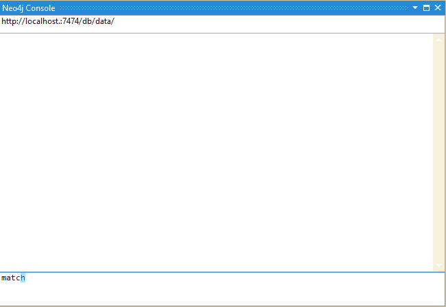

## What is Neo4j Console?

It's an extension for Visual Studio (2013 & 2015, mebbe the others - if someone has it installed and wants to let me know ;) ) to allow you to query Neo4j from within VS.

I'm beginning to add the autocomplete, missing some context, but it's getting there:

## Install

* Download the [VSIX](https://visualstudiogallery.msdn.microsoft.com/51e93d60-6339-479b-83f0-cc889bee7be7)
* Install from within Visual Studio via the 'Extensions and Updates' menu (under Tools)

## Debug

To debug within VS, right-click on the `Neo4jConsolePackage` project, and go to the `Properties`. Once there, select the `Debug` tab and:

* Change `Start Action` to: `Start External Program` with the Visual Studio instance of choice (in my case: `C:\Program Files (x86)\Microsoft Visual Studio 14.0\Common7\IDE\devenv.exe`)
* Change the `Start Options` and add to the `Command line arguments` box: `/rootsuffix Exp`

## Issues

Issues - raise [here](https://github.com/cskardon/neo4j-vs-console/issues), or email, twitter etc ([@cskardon](twitter.com/cskardon)) 

## License Information

Licensed under MS-PL. See `LICENSE` in the root of this repository for full license text.
